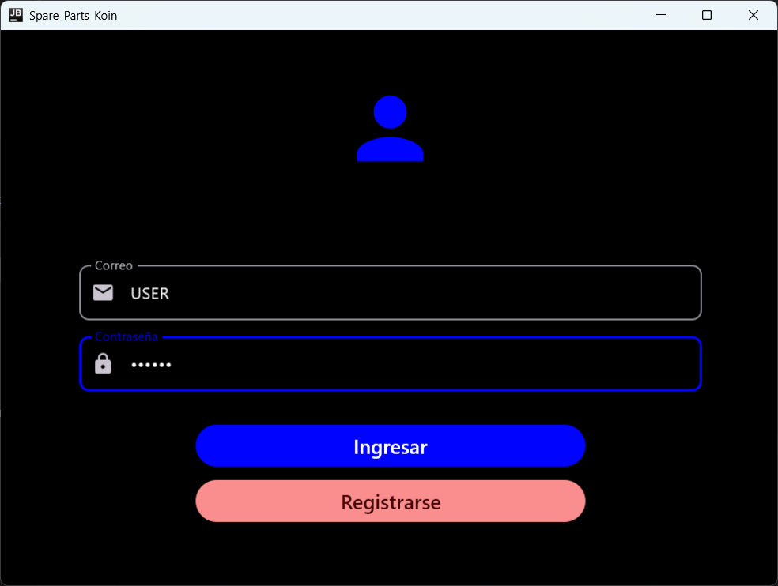
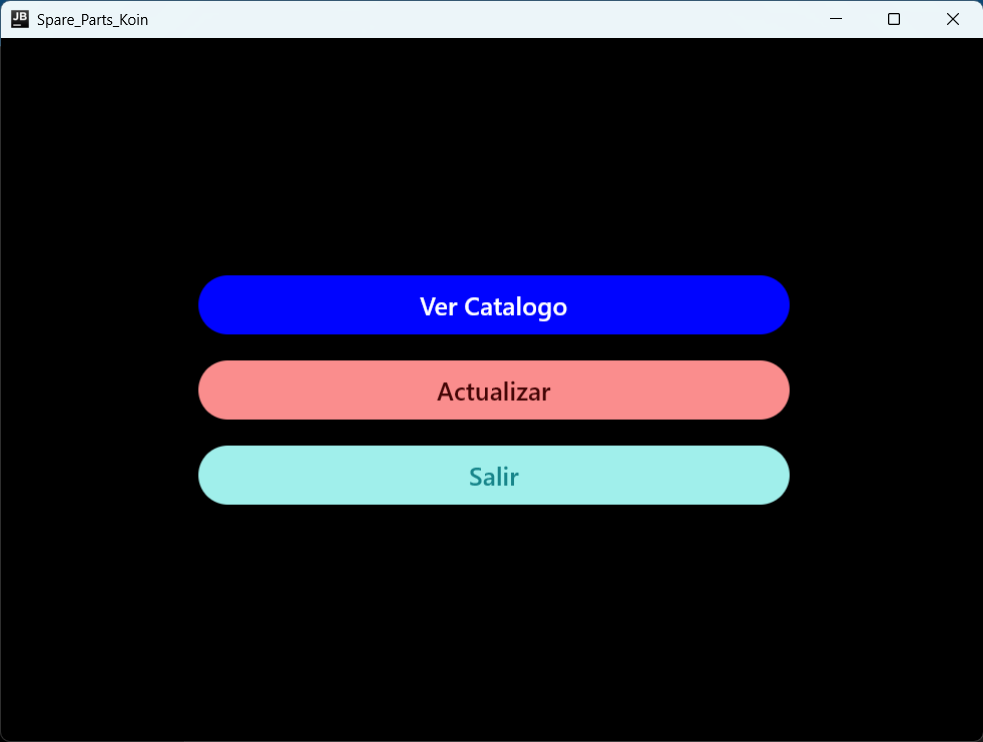
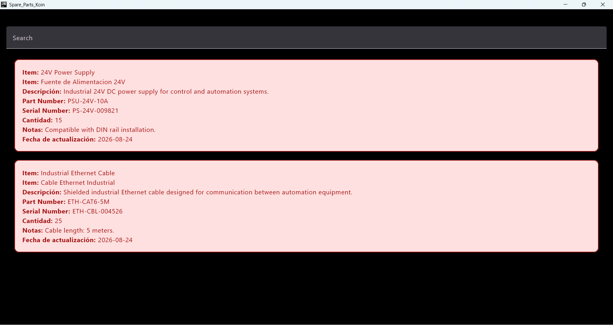
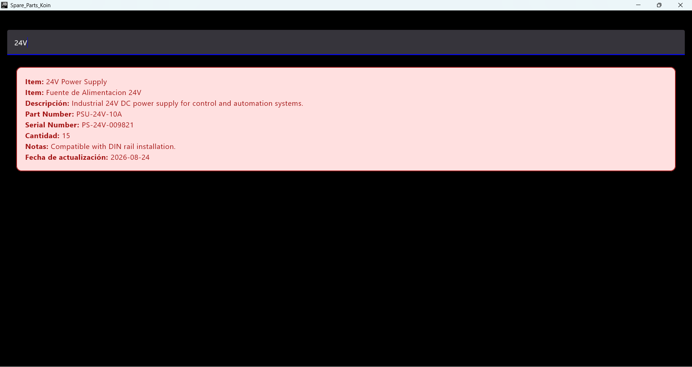
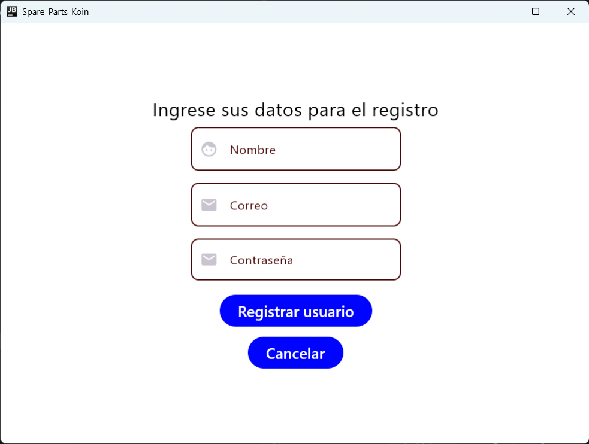

# Inventory Management KMP

Kotlin Multiplatform application for managing spare parts and equipment inventory.

The project is built with **Kotlin Multiplatform** and **Compose Multiplatform**, sharing UI and application logic between **Android** and **Desktop**.

It consumes a REST API to retrieve inventory information and currently provides a functional spare-parts catalog with search capabilities.

> 🚧 **Project Status:** Functional Prototype / In Development

---

## 📌 About the Project

This project was created as a multiplatform client for equipment and spare-parts inventory management.

The application shares most of its UI and application logic through `commonMain`, allowing the same screens to run on both:

- **Android**
- **Desktop (JVM)**

The current implementation focuses on spare-parts visualization and API integration.

The application consumes the companion backend project:

**Inventory Management API**

which provides CRUD endpoints for spare parts and equipment.

---

## 🛠 Tech Stack

- **Kotlin Multiplatform**
- **Compose Multiplatform**
- **Material 3**
- **Ktor Client**
- **Kotlinx Serialization**
- **Koin**
- **Voyager**
- **AndroidX ViewModel**
- **Coroutines**
- **Kermit**
- **Gradle**

### Supported Targets

- Android
- Desktop / JVM

Desktop distributions are configured for:

- Windows (`.msi`)
- macOS (`.dmg`)
- Linux (`.deb`)

---

## ✨ Current Features

### Implemented

- Shared Compose Multiplatform UI for Android and Desktop.
- Navigation between application screens.
- Spare-parts catalog retrieved from a REST API.
- Inventory items displayed as cards.
- Search and filtering by:
  - Item name
  - Part number
  - Serial number
- ViewModel-based UI state management.
- Repository-based data access.
- REST API communication using Ktor Client.
- Dependency injection using Koin.

### UI Prototypes

The following screens are currently implemented at UI level but are not yet connected to authentication services:

- Login
- User registration

### In Development

- Spare-part update workflow.
- Equipment catalog.
- User authentication.
- User registration backend integration.
- Additional inventory-management operations.

---

## 🧭 Application Flow

```text
Login Screen
    │
    │ UI prototype
    ▼
Main Menu
    │
    ├── View Catalog ✅
    │       │
    │       ▼
    │  Spare Parts Catalog
    │       │
    │       ├── Display inventory
    │       └── Search / Filter
    │
    ├── Update 🚧
    │
    └── Exit
```

---

## 🏗 Architecture

The current project separates UI, state management, data access and networking responsibilities.

```text
Compose UI
    │
    ▼
ViewModel
    │
    ▼
Repository
    │
    ▼
Service
    │
    ▼
Ktor Client
    │
    │ REST / HTTP
    ▼
Inventory Management API
```

The shared implementation lives primarily inside `commonMain`.

A simplified project structure is:

```text
composeApp/
├── src/
│   ├── commonMain/
│   │   └── kotlin/
│   │       └── org.montra.crudmultiplatform/
│   │           ├── data/
│   │           │   ├── model/
│   │           │   ├── network/
│   │           │   └── repository/
│   │           ├── di/
│   │           ├── theme/
│   │           ├── ui/
│   │           │   └── screen/
│   │           ├── viewmodel/
│   │           ├── App.kt
│   │           └── Platform.kt
│   │
│   └── desktopMain/
```

---

## 🌐 Backend Integration

The application is designed to work with the companion backend:

**inventory-management-api**

```text
Inventory Management KMP
        │
        │ Ktor / REST
        ▼
Inventory Management API
        │
        │ FastAPI + SQLModel
        ▼
      Database
```

The backend currently provides CRUD operations for:

- Spare parts
- Equipment

The public backend version uses SQLite for local development, while the original design supports a remote MySQL database.

---

## 📸 Screenshots

### Login UI & Main Menu

> Authentication is not implemented yet. This screen currently demonstrates the shared multiplatform UI and navigation flow.

<table>
  <tr>
    <td align="center">
      <strong>Login</strong>
    </td>
    <td align="center">
      <strong>Main Menu</strong>
    </td>
  </tr>
  <tr>
    <td>
      
    </td>
    <td>
      
    </td>
  </tr>
</table>

### Spare Parts Catalog

<p align="center">
  
</p>

### Inventory Search

The catalog supports filtering by item name, part number and serial number.

<p align="center">
  
</p>

### Registration UI

> User registration is currently implemented only at UI level.

<p align="center">
  
</p>

---

## 🚀 Running the Project

### Clone the repository

```bash
git clone https://github.com/fer-gomez-orfe/inventory-management-kmp.git
cd inventory-management-kmp
```

Open the project using **Android Studio** or another IDE with Kotlin Multiplatform support.

---

## 🖥 Run on Desktop

The project includes a JVM Desktop target.

On Windows:

```bash
gradlew.bat :composeApp:run
```

On Linux / macOS:

```bash
./gradlew :composeApp:run
```

---

## 📱 Run on Android

Open the project in Android Studio and run the `composeApp` Android configuration on an emulator or physical Android device.

The UI and most application logic are shared through `commonMain`.

---

## 📦 Desktop Distribution

The project is configured to generate native desktop distributions for:

```text
Windows → MSI
macOS   → DMG
Linux   → DEB
```

The corresponding Compose Desktop configuration uses:

```text
org.montra.crudmuliplatform.MainKt
```

as the Desktop entry point.

---

## 🗺 Roadmap

- [x] Kotlin Multiplatform project setup
- [x] Android target
- [x] Desktop target
- [x] Shared Compose Multiplatform UI
- [x] Ktor REST API integration
- [x] Koin dependency injection
- [x] Spare-parts catalog
- [x] Inventory search and filtering
- [x] ViewModel state management
- [ ] Implement authentication
- [ ] Connect user registration to backend
- [ ] Complete spare-part update workflow
- [ ] Implement equipment catalog
- [ ] Complete CRUD operations from the client
- [ ] Add automated tests
- [ ] Add CI/CD workflow

---

## 🎯 Project Goals

This project is being developed to explore and apply:

- Kotlin Multiplatform development
- Shared UI with Compose Multiplatform
- Cross-platform application architecture
- REST API integration
- Dependency injection
- State management with ViewModel
- Repository-based data access
- Client-server integration

The project also serves as a practical example of sharing application logic and UI between Android and Desktop while consuming a common backend service.

---

## 👤 Author

**Fernando Gómez García**

Software & Integration Engineer  
Android · Kotlin · REST APIs · SQL · IoT Solutions
